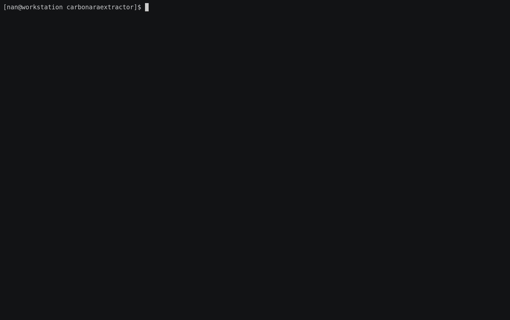

## Carbonara Extractor :spaghetti:

Product specifications extractor driven by a DOM Classifier.

_Note: this is an old PoC developed to demonstrate how tables and lists of the DOM can be classified before being extracted._

## how to run

To install dependencies:

    python3.7 -m venv venv
    source ./venv/bin/activate
    pip install --upgrade pip
    pip install -r requirements.txt

To extract information from an URL, simple run:

    > python -m carbonaraextractor "https://www.dpreview.com/products/canon/slrs/canon_eosm50"
    ...
    ...
    ...
    > cat result.json
    {
    "Articulated LCD": "Fully articulated",
    "Body type": "SLR-style mirrorless",
    "Dimensions": "116 x 88 x 59 mm (4.57 x 3.46 x 2.32″)",
    "Effective pixels": "24 megapixels",
    "Focal length mult.": "1.6×",
    "Format": "MPEG-4, H.264",
    "GPS": "None",
    "ISO": "Auto, 100-25600 (expands to 51200)",
    "Lens mount": "Canon EF-M",
    "Max resolution": "6000 x 4000",
    "Max shutter speed": "1/4000 sec",
    "Screen dots": "1,040,000",
    "Screen size": "3″",
    "Sensor size": "APS-C (22.3 x 14.9 mm)",
    "Sensor type": "CMOS",
    "Storage types": "SD/SDHC/SDXC slot (UHS-I compatible)",
    "USB": "USB 2.0 (480 Mbit/sec)",
    "Weight (inc. batteries)": "390 g (0.86 lb / 13.76 oz)",
    "__unstructured": []
    }

The standard output shows information about every Table and List found on the specified URL with their "relevance" scores given by the classifiers.  Every red row is a table/list that the classifier has tagged as *unrelevant*.  Every green row is a table/list that the classifier think is *relevant* about the trained domain. The relevant content is then parsed as `<key, value>` pairs and reported inside the file `result.json`.  

## classifiers

The project uses two simple classifiers trained on the "Camera" domains, implemented with Keras and saved inside `models/`.

The notebook `notebooks/train_classifiers` show the process of traning/testing/saving of the models. 

The datasets used are inside the `data` folder which contains:

   1. `list.csv`: features values extracted for relevant/not_relevant lists. The features are extracted from a corpus of webpages not shared here.
   2. `table.csv`: features values extracted for relevant/not_relevant tables. The features are extracted from a corpus of webpages not shared here.
   3. `camera_hot_words.txt`: 200 *stems* of relevant words about the "Cameras" domain.
   4.  `list_xpath_ground_truth.txt`: xpath for relevant lists for known domains.
   5.  `table_xpath_ground_truth.txt`: xpath for relevant tables for known domains.
